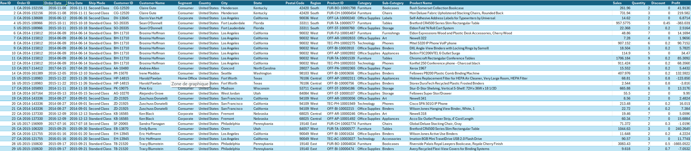

# 📊 Analyse des performances des ventes — Excel

## 🎯 Objectif

Ce projet consiste à développer un **tableau de bord interactif sous Microsoft Excel** afin de transformer des données historiques de ventes en indicateurs utiles au pilotage commercial.

L’analyse vise notamment à évaluer les ventes et la rentabilité, identifier les catégories et sous-catégories performantes et mettre en évidence les régions et situations nécessitant une attention particulière.

## 📑 Table des matières

- [🎯 Objectif](#-objectif)
- [🗂️ Données](#️-données)
- [🛠️ Méthodologie](#️-méthodologie)
- [📊 Tableau de bord](#-tableau-de-bord)
- [🔎 Principaux insights](#-principaux-insights)
- [💡 Recommandations](#-recommandations)
- [⚠️ Limitations](#-limitations)
- [🧰 Outils](#-outils)

---

## 🗂️ Données

Le jeu de données contient notamment les informations suivantes :

- Commandes et clients
- Dates de commande et d’expédition
- Région, État et ville
- Segment client
- Catégorie et sous-catégorie de produits
- Ventes
- Quantité
- Rabais
- Profit

  

---

## 🛠️ Méthodologie

Le projet suit quatre grandes étapes :

### 1. Préparation des données

- Vérification des doublons
- Vérification des valeurs manquantes
- Validation des types de données

### 2. Analyse

Analyse des :

- Ventes et profits
- Performances par État et par région
- Performances par catégorie de produits
- Performances par segment
- Évolutions temporelles
- Effets des rabais

### 3. Visualisation

Création de :

- Tableaux croisés dynamiques
- KPI interactifs
- Graphiques dynamiques
- Segments pour filtrer les résultats

### 4. Interprétation

- Identification des marchés performants et déficitaires
- Analyse des écarts entre ventes et rentabilité
- Formulation de recommandations opérationnelles

---

## 📊 Tableau de bord

Le dashboard permet de filtrer dynamiquement les résultats selon :

- Mode de livraison
- Segment
- État
- Région
- Catégorie de produits
- Trimestre
- Année

### KPI

- **Ventes totales**
- **Profit total**
- **Taux de marge**
- **Nombre de commandes**

### Visualisations

- Profit et ventes par État
- Carte des ventes par État
- Évolution des ventes et profits
- Profit par niveau de rabais et catégorie
- Profit par segment
- Ventes et profits par catégorie

  

---

## 🔎 Principaux insights

### 🌎 Performance régionale

La croissance des ventes ne se traduit pas systématiquement par une hausse de la rentabilité.

Le **Texas**, par exemple, affiche environ **170 188 $ de ventes mais une perte de 25 729 $** sur la période 2014–2017.

Des situations déficitaires sont également observées dans plusieurs autres États.

### 📈 Performance temporelle

Les ventes progressent entre 2014 et 2017, avec une saisonnalité marquée :

- Le **4e trimestre** génère généralement le chiffre d'affaires le plus élevé.
- Le **1er trimestre** demeure généralement le plus faible.
- La progression du profit ne suit toutefois pas toujours celle des ventes.

### 💻 Catégories et rabais

La catégorie **Technologie** est la plus profitable, avec un profit approchant **135 000 $**.

Les rabais supérieurs à **20 %** semblent fortement réduire la rentabilité.

### 👥 Segments

Les particuliers représentent **47 % des achats**, contre :

- **32 %** pour les entreprises
- **21 %** pour les travailleurs autonomes

### 🏆 Produits performants

Les sous-catégories suivantes se distinguent par leur volume ou leur contribution commerciale :

**Chaises · Tables · Relieurs · Rangements · Cellulaires**

Les **tables** méritent toutefois une attention particulière puisqu'elles figurent parmi les produits les plus vendus tout en générant des pertes.

---

## 💡 Recommandations

- Prioriser les catégories les plus rentables, notamment la **Technologie**.
- Renforcer les actions commerciales dans les marchés à fort potentiel comme la **Californie, New York et le Texas**, tout en distinguant volume de ventes et rentabilité.
- Mettre en place un suivi régulier des KPI.
- Encadrer davantage les rabais dans les États déficitaires afin de protéger les marges.

---

## ⚙️ Limitations

- Données limitées à la période **2014–2017**.  
- Absence de variables externes (coûts logistiques, concurrence, saisonnalité avancée).

---

## 🧰 Outils

`Microsoft Excel` · `Tableaux croisés dynamiques` · `Segments` · `Visualisation de données` · `Analyse de données`
